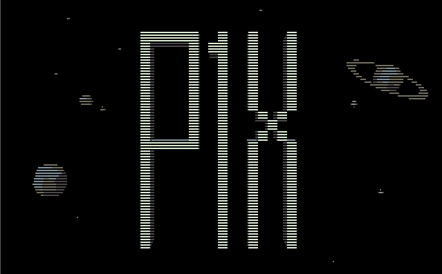
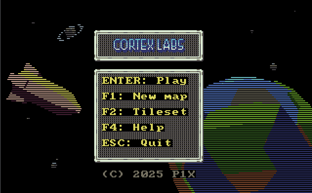
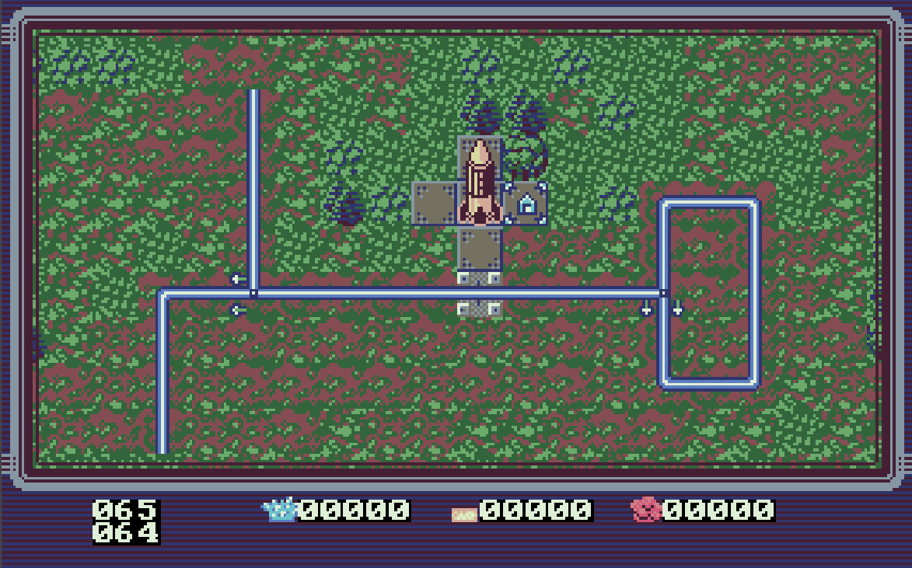
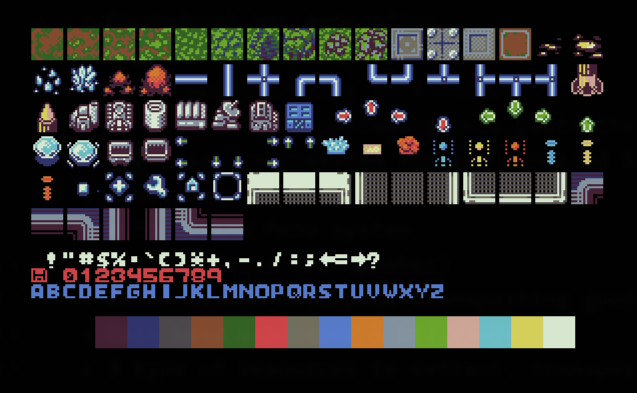

# 
Real-time strategy for x86 processors made in assembly.






## Running
Boot from a floppy or run on MS-DOS (FreeDOS).

## Building
Create floppy and binary.
```make```

Make just binary.
```make com```

For more targets check help.
```make help```

## Tools

### png2asm
For compressing .png tilemap.
```./png2asm tileset.png palettes.png ../../src/tiles.asm```

### rleimg2asm
For compressing .png image.
```./rleimg2asm frames/p1x.png ../../src/img_p1x.asm -asm p1x_logo_image -stats```
