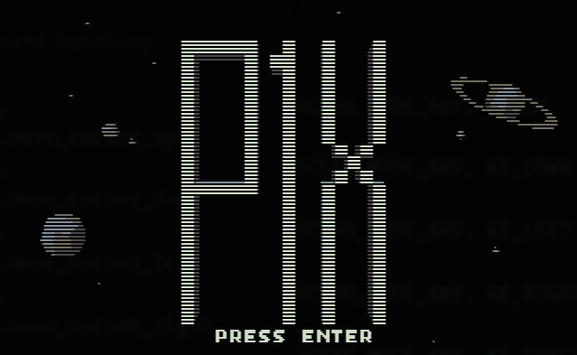

# 
Real-time strategy for x86 processors made in assembly.


## Features
* VGA 320x200, 16 colors, 4 colors per tiles, 3 + transparency for sprites
* Arne 16 color palette
* 2D tile-based top-down view
* Procedural map generation
* Big, 128x128 tiles, map
* 16x16 sprites/tiles in 4 colors
* No framebuffer, redrawing only parts that changed
* RLE image compression for pre-rendered backgrounds
* Game state machine
* Windows and Menu system
* Sound effects (PC Speaker)
* Rails system with pods transporting goods
* Main base expansion + buildings
* 3 type of resources to extract, transport, and refine
* Development tools (vibe coded C):
  * png2asm - compress tileset to assembly db
  * rleimg2asm - compress 320x200 images to assembly RLE db
  * fnt2asm - compress font tileset to assemlby db

## Tileset


## Running
Boot from a floppy or run on MS-DOS (FreeDOS).


## Building
Create floppy and binary:
```make```

Make just binary:
```make com```

Check statistics:
```make stats```

For more targets check help.
```make help```

## Tools

### png2asm
For converting .png tilemap into 2-bit compressed and palettes assembly code.
```./png2asm tileset.png palettes.png ../../src/tiles.asm```

### rleimg2asm
For converting .png image into RLE compressed assembly code.
```./rleimg2asm frames/p1x.png ../../src/img_p1x.asm -asm p1x_logo_image -stats```
### fnt2asm
For converting .png font charset into 1-bit compressed assembly code.
```./fnt2asm font.png ../../src/font.asm```


