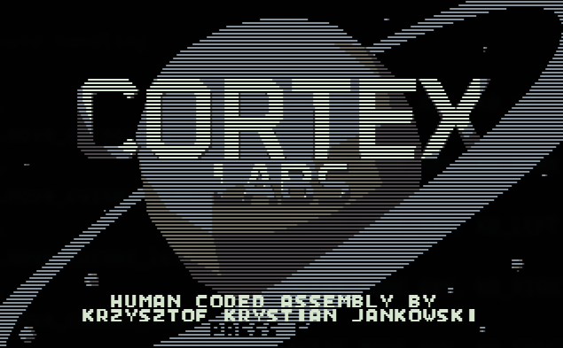
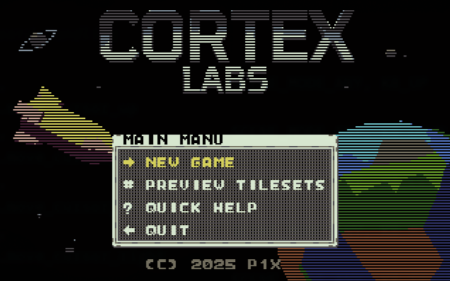
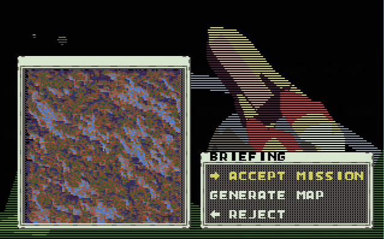

# 
Real-time strategy for x86 processors made in assembly.







## Running
Boot from a floppy or run on MS-DOS (FreeDOS).

## Building
Create floppy and binary:
```make```

Make just binary:
```make com```

Check statistics:
```make stats```

For more targets check help.
```make help```

## Tools

### png2asm
For converting .png tilemap into 2-bit compressed and palettes assembly code.
```./png2asm tileset.png palettes.png ../../src/tiles.asm```

### rleimg2asm
For converting .png image into RLE compressed assembly code.
```./rleimg2asm frames/p1x.png ../../src/img_p1x.asm -asm p1x_logo_image -stats```
### fnt2asm
For converting .png font charset into 1-bit compressed assembly code.
```./fnt2asm font.png ../../src/font.asm```
