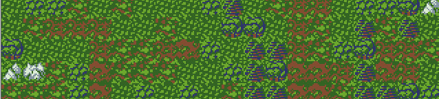
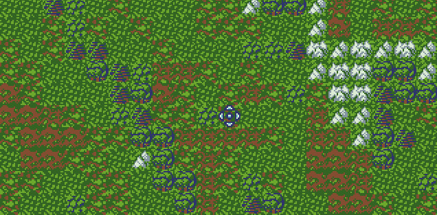
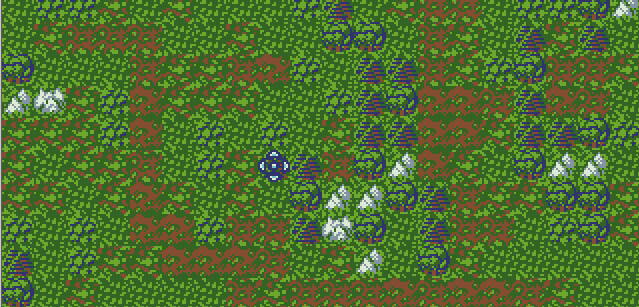
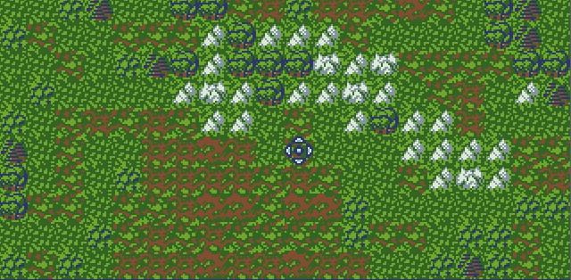

# World Map Generation



Code generates the procedural map using simple rules (TerrainRules).
Rules defines what type of tiles can be generated next to each other. For each tile type 4 corresponding types are defined. For 10 tiles, 10 entries are defined (each holding 4 bytes.)

```
TerrainRules:
db 0, 1, 1, 2   ; 0 Mud 1
db 1, 1, 2, 3   ; 1 Mud 2
db 2, 2, 1, 3   ; 2 Mud Grass 1
db 2, 3, 4, 4   ; 3 Mud Grass 2
db 3, 4, 4, 5   ; 4 Grass
db 4, 3, 5, 6   ; 5 Bush
db 6, 7, 7, 4   ; 6 Trees 1
db 7, 6, 4, 8   ; 7 Trees 2
db 7, 8, 8, 9   ; 8 Mountains 1
db 9, 8, 8, 7   ; 9 Mountain 2
```

1. Algorithm selects for each cell up or left tile next to it and checks in the defined array what can be placed.
2. Selects randomly new tile.
3. Moves to next.

First tile in a colum is selected randomely as there is nothing on the left.
Same for the first top row of tiles.


```
xor di, di
mov si, TerrainRules
mov cx, MAP_SIZE                      ; Height
.next_row:
  mov dx, MAP_SIZE                    ; Width
  .next_col:
    call get_random                   ; AX is random value
    and ax, TERRAIN_RULES_MASK        ; Crop to 0-3
    mov [es:di], al                   ; Save terrain tile
    cmp dx, MAP_SIZE                  ; Check if first col
    je .skip_cell
    cmp cx, MAP_SIZE                  ; Check if first row
    je .skip_cell
    movzx bx, [es:di-1]               ; Get left tile
    test al, 0x1                      ; If odd value skip checking top
    jz .skip_top
    movzx bx, [es:di-MAP_SIZE]        ; Get top tile
    .skip_top:
    shl bx, 2                         ; Mul by 4 to fit rules table
    add bx, ax                        ; Get random rule for the tile ID
    mov al, [ds:si+bx]                ; Get the tile ID from rules table
    mov [es:di], al                   ; Save terrain tile
    .skip_cell:
    inc di                            ; Next map tile cell
    dec dx                            ; Next column (couner is top-down)
  jnz .next_col
loop .next_row
```

Only 27 lines to generate terrain!




