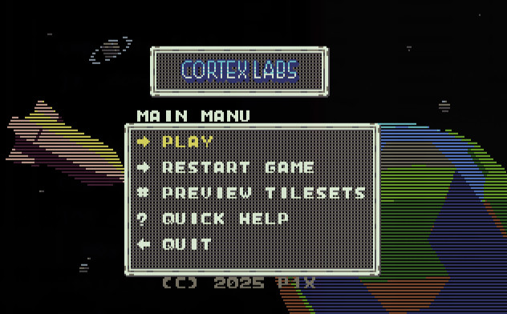

# Menu System


Now all menus in game are driven by data definitions and uses the same code to operate. Now it is easy to use arrows to navigate menus.

## Window Definitions

All menus are setup in the ```WindowDefinitionsArray```.
* height and width
* y and x position
* pointer to title
* pointer to selection array

```
WindowDefinitionsArray:
dw 0x060A, 0x0A0A, WindowMainMenuText, MainMenuSelectionArrayText
dw 0x080A, 0x040A, WindowBaseBuildingsText, WindowBaseSelectionArrayText
```

Each window and menu is defined then.

## Main Menu Example

```
WindowMainMenuText          db 'MAIN MANU',0x0
MainMenuSelectionArrayText:
  db '> PLAY',0x0
  db '> RESTART GAME',0x0
  db '# PREVIEW TILESETS',0x0
  db '? QUICK HELP',0x0
  db '< QUIT',0x0
  db 0x00
```



## Game Menu Example

```
WindowBaseBuildingsText     db 'BASE BUILDING',0x0
WindowBaseSelectionArrayText:
  db '< CLOSE WINDOW',0x0
  db 'EXPAND FOUNDATION',0x0
  db 'BUILD SILOS',0x0
  db 'BUILD FACTORY',0x0
  db 'BUILD RADAR',0x0
  db 'BUIILD LABORATORY',0x0
  db 'BUILD POD STATION',0x0
  db 0x00
```


## Selection
Current selecion position is defined in ```_MENU_SELECTION_POS_``` and length of current menu array in ```_MENU_SELECTION_MAX_```. Max value is set to the number number of menu entries currently loaded.

Using arrows the ```_MENU_SELECTION_POS_``` value is incremented or decremented. Clamped to 0-MAX positions. Current position is indicated by different color of text.

```
.selection_up:
  cmp byte [_MENU_SELECTION_POS_], 0x0
  je .done
  dec byte [_MENU_SELECTION_POS_]
jmp .redraw_window

 .selection_down:
   mov al, [_MENU_SELECTION_POS_]
   cmp al, [_MENU_SELECTION_MAX_]
   je .done
   inc byte [_MENU_SELECTION_POS_]
 jmp .redraw_window
```
