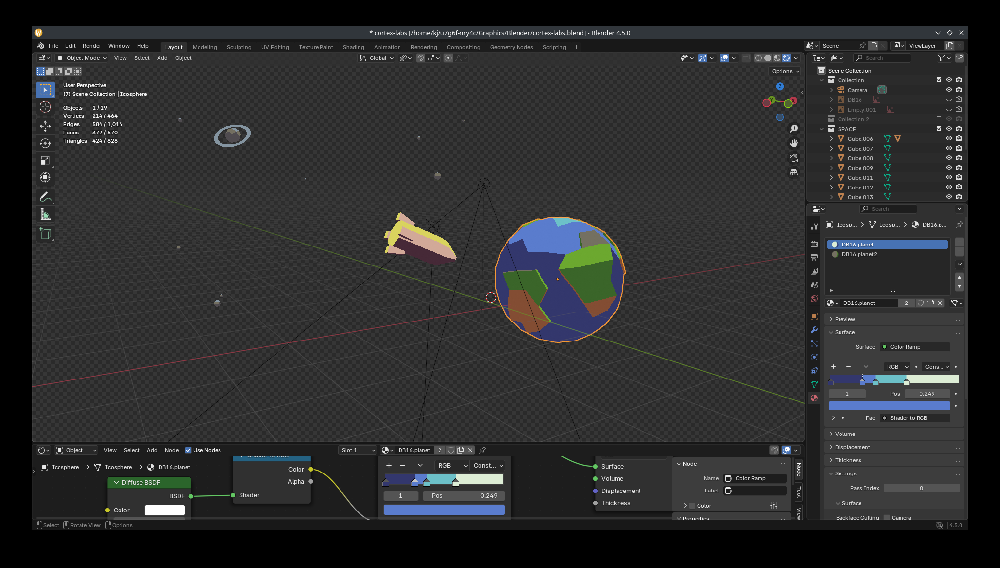
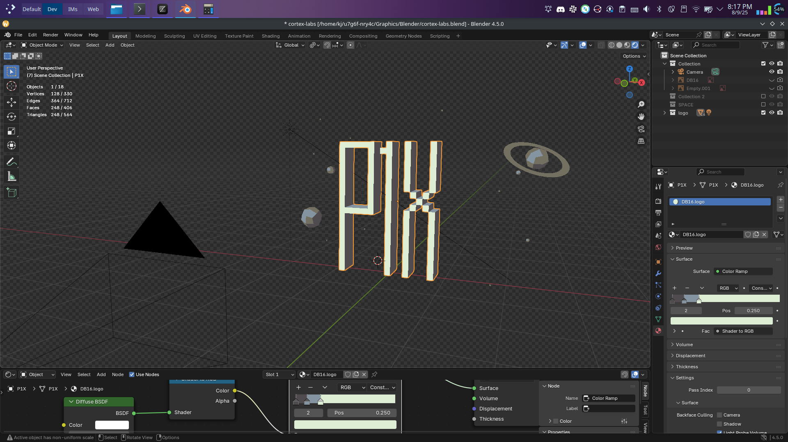
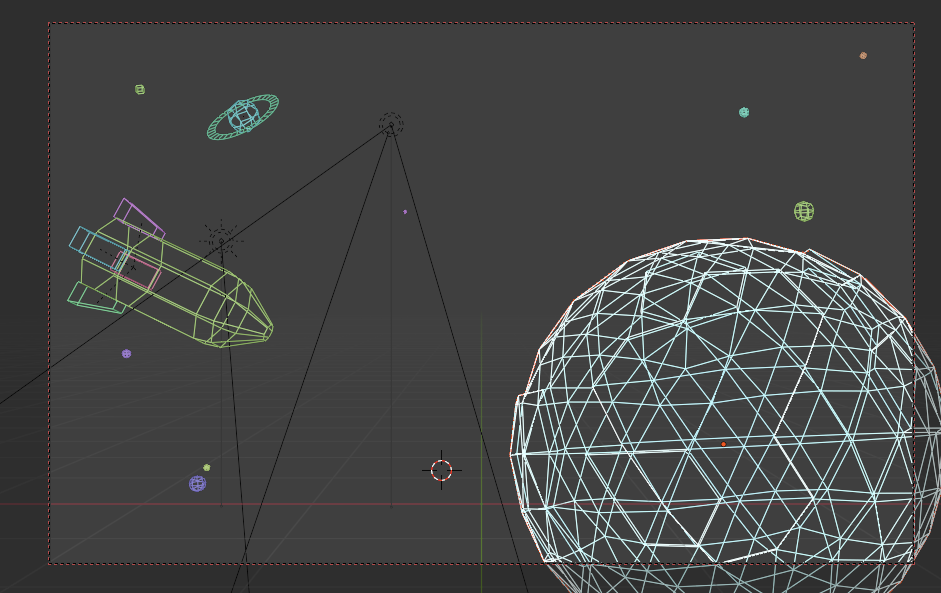
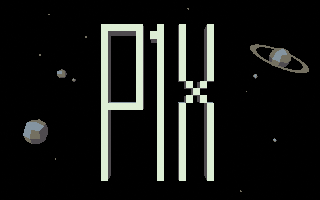
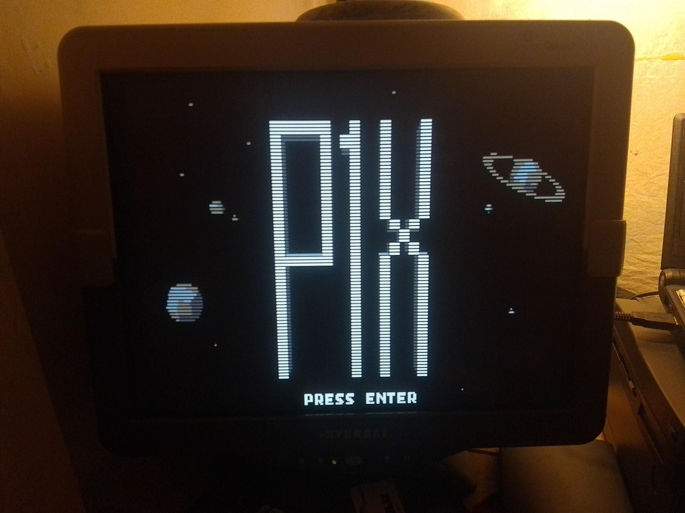
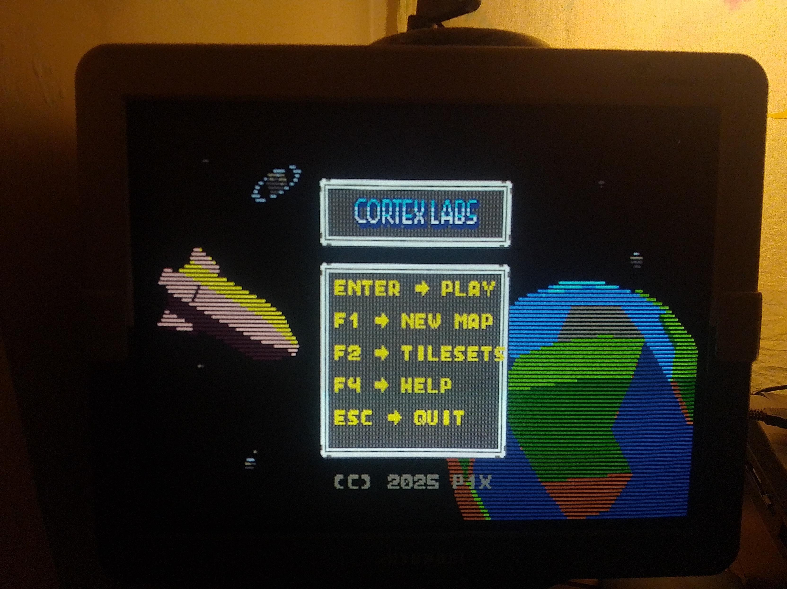

# RLE Compressed Images

Made using RLE compression with interlace (odd lines only).

## Blender
Background made in blender. Low poly with simple "pixel art" shader for shading with only 4 colors (per model).

## Intro Scene Render

Compression Statistics (Interlaced):
* Original size: 64000 bytes
* Compressed size: 2494 bytes (even lines only)
* Effective compression ratio: 25.66:1 (96.1%)

## Menu Scene Render

Compression Statistics (Interlaced):
* Original size: 64000 bytes
* Compressed size: 1342 bytes (even lines only)
* Effective compression ratio: 47.69:1 (97.9%)

## In Engine / Game

