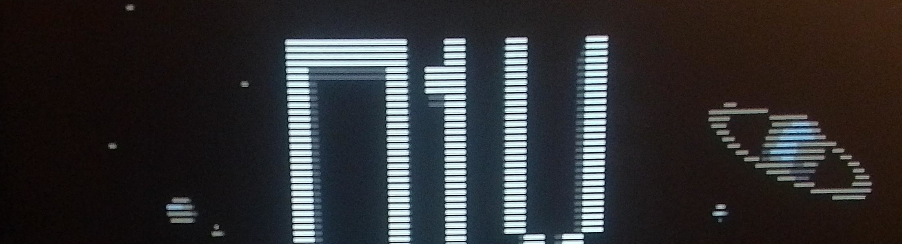

# RLE Compressed Images



Made using RLE compression with interlace (odd lines only).

## Blender
Background made in blender. Low poly with simple "pixel art" shader for shading with only 4 colors (per model).


## Intro Scene Render


Compression Statistics (Interlaced):
* Original size: 64000 bytes
* Compressed size: 2494 bytes (even lines only)
* Effective compression ratio: 25.66:1 (96.1%)

## Menu Scene Render


Compression Statistics (Interlaced):
* Original size: 64000 bytes
* Compressed size: 1342 bytes (even lines only)
* Effective compression ratio: 47.69:1 (97.9%)


## Compression

I'm using my tool rle2asm that converts 320x200 png files into an assembly string of bytes.

```./rleimg2asm frames/p1x.png ../../src/img_p1x.asm -asm p1x_logo_image -stats```

The file ```img_p1x.asm``` looks like that:
```
p1x_logo_image:
    db 0FFh, 000h, 041h, 000h, 0FFh, 000h, 041h, 000h, 0FFh, 000h, 041h, 000h, 0FFh, 000h, 041h, 000h
    db 0BBh, 000h, 002h, 007h, 083h, 000h, 0FFh, 000h, 041h, 000h, 0FFh, 000h, 041h, 000h, 030h, 000h
    db 002h, 007h, 0FFh, 000h, 00Fh, 000h, 0FFh, 000h, 041h, 000h, 0FFh, 000h, 041h, 000h, 0FFh, 000h
    db 041h, 000h, 0FFh, 000h, 041h, 000h, 065h, 000h, 02Ah, 00Fh, 00Eh, 000h, 007h, 00Fh, 00Fh, 000h
    ...
```

## Decompression

Last step is to decompress the data.
Read length. Then color. Draw a line.

```
xor di, di
xor bx, bx
xor dx, dx
.image_loop:
  lodsb                               ; Load number of pixels to repeat
  mov cx, ax                          ; Save to CX
  add bx, ax                          ; Add to overall pixels counter
  add dx, ax                          ; Add to line pixel counter

  lodsb                               ; Load pixel color
  rep stosb                           ; Push pixels (CX times)

  cmp dx, SCREEN_WIDTH                ; Check if we fill full line
  jl .continue                        ; Continue if not
  add di, SCREEN_WIDTH                ; Jump interlaced line
  xor dx, dx                          ; Zero line counter
  .continue:

  cmp bx, SCREEN_WIDTH*(SCREEN_HEIGHT/2)  ; Check if full image drown
  jl .image_loop                      ; Continu if not
```

## In Engine / Game


